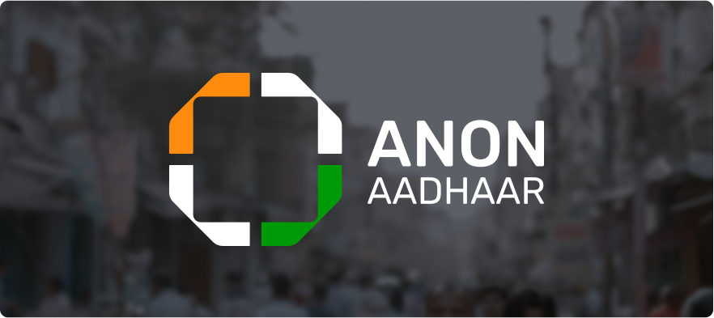

# Introduction

Let's discover **Anon Aadhaar**.

## What's Anon Aadhaar?

### Overview

Anon Aadhaar is a zero-knowledge protocol that allows Aadhaar ID owners to prove their identity in a privacy preserving way. It provides a set of tools to generate and verify proofs, authenticate users and verify proofs on-chain.

### Features

With anon aadhaar, you can do the following:

- Generate and verify PCD ZKPs using our [PCD package](https://github.com/privacy-scaling-explorations/anon-aadhaar/tree/main/packages/anon-aadhaar-pcd).
- Integrate with our [SDK](https://github.com/privacy-scaling-explorations/anon-aadhaar/tree/main/packages/anon-aadhaar-react) to authenticate users based on the PCD ZKP.
- Verify PCD ZKPs on-chain with our [Verifier contract](https://github.com/privacy-scaling-explorations/anon-aadhaar/tree/main/packages/anon-aadhaar-contracts)

### About the code

The Anon Aadhaar protocol is built arount a circuit that take the RSA signature contained in the Aadhaar pdf and verifies that it was issued by the Indian government public key. Anon Aadhaar is using the PCD framework to handle proofs, that makes it very easy to use them.
In addition to the circuit, Anon Aadhaar provides a Solidity Verifier contract and a react library that allow developers to authenticate users based on generated and verified zero-knowledge proofs with minimal effort.

### Links

- [Anon Aadhaar repo](https://github.com/privacy-scaling-explorations/anon-aadhaar)
- [`anon-aadhaar-pcd` package](https://www.npmjs.com/package/anon-aadhaar-pcd)
- [`anon-aadhaar-react` package](https://www.npmjs.com/package/anon-aadhaar-react)
- [`anon-aadhaar-contracts` package](https://www.npmjs.com/package/anon-aadhaar-contracts)
- [Anon Aadhaar example app](https://anon-aadhaar-example.vercel.app/)
- [Anon Aadhaar example repo](https://github.com/anon-aadhaar-private)
